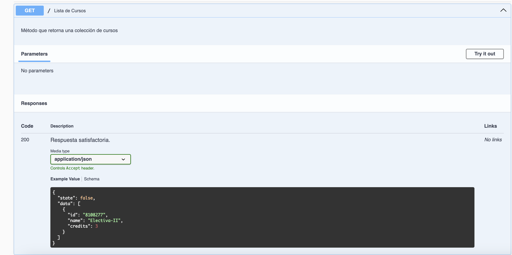

# Documentar son Swagger UI y JSDoc

Proyecto que explora aspectos de documentación de una API RESTFul que se ha desarrollado con el stack `Javascipt`. 

## Herramientas usadas

- NodeJS
- Express
- Nodemon
- Swagger
- JSDoc

[JSDoc](https://jsdoc.app/) es una herramienta para generar documentación de comentarios en el código fuentes de aplicaciones JS. [Swagger ](https://swagger.io/), de otra parte, permite documentar, y utilizar servicios web RESTful, provee una herramienta para representar la documentación [Swagger UI](https://swagger.io/tools/swagger-ui/), que crea una página web con especificaciones y permite interactuar con la API a través de sus diferentes métodos de llamado a los end points.

## Prerrequisitos

- Estar familiarizado con REST APIs y NodeJS con Express
- Tener una REST API basada en Express

## 1. Configurar la aplicación

### Instalar dependencias

Instalar `swagger-jsdoc` y `swagger-ui-express`

```bash
npm install swagger-jsdoc swagger-ui-express
```

- ___swagger-jsdoc___ Genera las "Open API definitions" a partir de la documentación de JSDoc
- ___swagger-ui-express___ Crea los componentes de la página web para estas definiciones

### Crear una especificación de la API

Swagger-UI crea una página de documentos a partir de un conjunto de definiciones de OpenAPI. Estas definiciones están escritas en YAML o JSON para describir una API REST. Para obtener más información sobre la estructura básica de la especificación OpenAPI, consulte [Estructura básica](https://swagger.io/docs/specification/basic-structure/).

En un archivo (swagger.js) en la raíz del proyecto, escribir el código siguiente:

```javascript
//swagger.js
const swaggerJSDoc = require('swagger-jsdoc')

const swaggerDefinition = {
  openapi : '3.0.0',
  info : {
    title : 'MyAPI',
    version: '1.0.0',
    description:'Ejemplo de documentar son Swagger'
  },
}

const options = {
  swaggerDefinition,
  apis:['./routes/*.js'],
}

const swaggerSpec = swaggerJSDoc(options)

module.exports = swaggerSpec
```

El objeto `swaggerDefinition` define la información de la raíz de la API. El objeto `options` contiene el objeto swaggerDefinition y una matriz de rutas llamadas `apis`. Estas son rutas a archivos que contienen otras definiciones de OpenAPI. Estas rutas de archivos deben ser relativas al directorio raíz de su API Express. Para el ejemplo, las definiciones se escribirán en `JSDoc` directamente en los archivos `./routes`. Puede enumerar los nombres de archivos individualmente o utilizar el delimitador comodín * para agregar todos los archivos JavaScript en un directorio, como se muestra arriba.

Swagger-jsdoc utiliza el objeto de opciones para producir una especificación OpenAPI en una variable llamada `swaggerSpec`. Esta especificación es equivalente al archivo swagger.json o swagger.yaml que normalmente usa Swagger UI para crear una página de documentos. 

### Crear la página de documentos de la UI

En el archivo de configuración del servidor incluir el `swagger-ui-express` y el archivo de deinición creado anteriormente en el archivo `swagger.js` y se crea un end point a la documentación de la API.

```javascript
//index.js
const express = require('express')

const app = express()

const swaggerUI = require('swagger-ui-express')
const swaggerSpec = require('./swagger')

app.use('/docs',swaggerUI.serve,swaggerUI.setup(swaggerSpec))
app.use('/',require('./routes/index'))

app.listen(3000,()=>console.log('Server ready'))
```

Como se muestra arriba, swagger-ui-express proporciona dos devoluciones de llamada para configurar el punto final: una para configurar la interfaz de usuario de Swagger con las definiciones de swaggerSpec y otra para enviarla al punto final /docs.

### Crear un archivo de rutas

En la carpeta `routes` a través de un archivo `index.js` se establece un end point a la ruta de la raiz

```javascript
//routes/index.js
const router = require('express').Router()

router.get('/',(req,res)=> res.status(200).json({state:true,message:"Hello World!"}))

module.exports = router
```

Reinicie el servidor y probar los end point del método de llamado GET (/) y al docs de swagger


Como se observa se obtiene la documentación básica con Swagger. Ahora queda crear la definiciones de Open API

## Definir la información raíz de la API

Se ha creado una página de documentos de Swagger UI y está listo para comenzar a escribir documentos. Pero primero, se va a agregar más definiciones raíz para la API.

En el archivo de configuración `swagger.js` complementar la información para asignar al objeto de información de OpenAPI un título, una descripción, una lista de servidores, información de contacto y una lista de rutas para la API.

Reinicie el servidor y despliegue el sitio con los cambios del archivo de definición en el end point de `docs`. Se obtendría una vista como la siguiente


## Escribir la documentación

Con una página de documentos de Swagger UI disponible en el punto final /docs y un conjunto completo de información raíz en la API, se puede comenzar a escribir las definiciones de las rutas. Cada definición de ruta corresponde a una ruta Express en la API. Describe tanto la operación como la ruta del punto final.

### Documentar las rutas

En el archivo `routes/index.js` para cada ruta adicionar un comentario iniciando con `@swagger`, a continuación se describe la información básica sobre la ruta. En la [Open API Guide](https://swagger.io/docs/specification/about/) se encuentra la información de referencia para las diferentes opciones de documentación

```javascript
const router = require('express').Router()

/**
 * @swagger
 * /:
 *   get:
 *     summary: Recupera todos los registros
*/ 
router.get('/',(req,res)=> res.status(200).json({state:true,message:"Hello World!"}))

module.exports = router
```

Como se muestra en el ejemplo de código, agregue la ruta del punto final `/` y la operación get (con sangría de dos espacios).

> La descripción de la documentación usa un formato YAML, por lo cual se debe asegurar de usar dos o cuatro espacios en vez de tabulaciones. Para ver más información del formato, [consulte](https://docs.ansible.com/ansible/latest/reference_appendices/YAMLSyntax.html)

Reinicie el sevidor y actualice el sitio en [http://localhost:3000/docs](http://localhost:3000/docs)

Se observa la siguiente vista


### Documentar las respuestas

#### Documentar Ruta GET

Los usuarios querrán saber qué se devuelve cuando esta solicitud GET se realiza correctamente (es decir, con un código de estado de 200). Para definir una respuesta exitosa, agregue un objeto de respuestas y una respuesta llamada 200 a la definición de ruta, si hay varios códigos de respuesta, se deben documentar cada una. En el siguiente ejemplo de código, se documenta la ruta GET a la raíz del sitio que retorna una colección de cursos:

```javascript
const courses = [{"id":"8008255","name":"Programación-I","credits":4},{"id":"8008256","name":"Programación-II","credits":4},{"id":"8008257","name":"Programación-III","credits":4},{"id":"8108277","name":"Electiva-II","credits":3},]

/**
 * @swagger
 * /:
 *   get:
 *     summary: Lista de Cursos
 *     description: Método que retorna una colección de cursos
 *     responses:
 *       '200':
 *         description: Respuesta satisfactoria.
 *         content:
 *           application/json:
 *             schema:
 *               type: object
 *               properties:
 *                 state:
 *                   type : boolean
 *                   description: Indica éxito en la consulta de los datos
 *                   example: false
 *                 data:
 *                   type: array
 *                   items:
 *                     type: object
 *                     properties:
 *                       id:
 *                         type: string
 *                         description: Especifica el ID del curso
 *                         example: 8108277
 *                       name:
 *                         type: string
 *                         description: Hace referencia al nombre del curso
 *                         example: Electiva-II
 *                       credits:
 *                         type: integer
 *                         description: Especifica el número de créditos del curso
 *                         example: 3
 *         '501':
 *           description: Error
 *           content: 
 *             text/plain:
 *               schema:
 *                 type: string
 *                 example: Oh!! Algo ha pasado           
 */
router.get('/',(req,res)=> res.status(200).json({state:true,data:courses}))
```

> Hay que tener en cuenta que el formato es YAML y que se debe dejar espacio después de los dos puntos (:) que separa la clave del valor, de igual forma la indentación es importante para que se interprete en forma correcta el documento. 
>
> En la siguiente imagen se observa el resultado de la documentación



De igual manera, la vista con el resultado de pulsar en `Try out` y ejecutar la consulta o petición


#### Documentar GET con Parámetros

El siguiente código documenta el método GET que recibe un parámetro, para buscar un curso por ID

```javascript
/**
 * @swagger
 * /{id}:
 *   get:
 *     summary: Recuperar un curso por ID
 *     description: Realiza una búsqueda por ID
 *     parameters:
 *       - in: path
 *         name: id
 *         schema: 
 *           type: string
 *         required: true
 *         description: Id del curso para recuperar el objeto
 *     responses:
 *       '201':
 *         description: OK
 *         content:
 *           application/json:
 *             schema:
 *               type: object
 *               properties:
 *                 state:
 *                   type: boolean
 *                   description: Indica que el objeto se encuentra o no.
 *                 data:
 *                   type: object
 *                   properties:
 *                     id : 
 *                       type: string
 *                       description: ID del curso
 *                       example: 8108277
 *                     name:
 *                       type: string
 *                       description: Nombre del curso
 *                       example: Electiva-II
 *                     credits: 
 *                       type: integer
 *                       description: Créditos del curso
 *                       example: 3
 *       '401':
 *         description: NOT FOUND
 *         content:
 *           application/json:
 *             schema:
 *               type: object
 *               properties:
 *                 state:
 *                   type: boolean
 *                   description: Indica que el objeto no existe
 *                   example: false
 *                 msg: 
 *                   type: string
 *                   description: Mensaje de Error   
 */
router.get('/:id',(req,res)=>{
  const {id} = req.params
  const course = courses.find( c => c.id === id )
  if( course != null ){
    return res.status(201).json({state:true,data:course})
  }else{
    return res.status(401).json({state:false,msg:"Id no Existe"})
  }
  
})

```

Así mismo en las imágenes se observan los resultados de la UI de Swagger que permite especificar el parámetro, además de las respuestas que se pueden obtener.


#### Documentar método POST

Para el método POST, el código de ejemplo de la ruta recibe los datos en formato JSON y los devuelve. En el archivo de configuración del servidor, se debe especificar que express gestiona datos que vienen del cliente en formato JSON, también puede recibir en XML o datos desde formularios, para cada caso se debe especificar.

``` javascript
/**
 * @swagger
 * /:
 *   post:
 *     summary: Crea un Nuevo curso
 *     requestBody:
 *       description: Inserta un nuevo registro
 *       required: true
 *       content:
 *         application/json:
 *           schema:
 *             type: object
 *             properties:
 *               id:
 *                 type: string
 *                 description: Id del curso
 *                 example: 8108277
 *               name:
 *                 type: string
 *                 description: Nombre del curso
 *                 example: Electiva-II
 *               credits:
 *                 type: integer
 *                 description: Número de créditos del curso
 *                 example: 3
 *     responses:
 *       '201':
 *         description: SUCCESS
 *         content:
 *           application/json:
 *             schema:
 *               type: object
 *               properties:
 *                 id: 
 *                   type: string
 *                   description: ID del curso
 *                   example: 8108277
 *                 name:
 *                   type: string
 *                   description: Nombre del curso
 *                   example: Electiva-II
 *                 credits:
 *                   type: integer
 *                   description: Número de créditos del curso
 *                   example: 3
 */

router.post('/',(req,res)=>{
  const {id,name,credits} = req.body

  return res.status(201).json({"id":id,"name":name,"credits":credits})
})

```

En las siguientes imágenes se observa el resultado en la UI de Swagger, 


Al pulsar en el botón de `Try it out` se obtiene una vista con el schema del objeto para enviar los datos.


